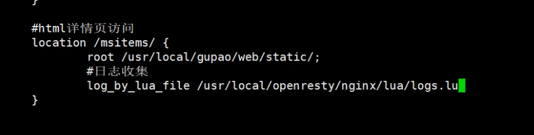

# 笔记
- jrebel激活服务器https://jrebel.com.cn/#/

## 页面
- mall-page-web 
  - 商品详情页生成
- mall-search-web
  - 搜索结果
- mall-cart-service
  - 购物车
## 服务列表
- 修改host `C:\Windows\System32\drivers\etc`
  192.168.100.51 yougoushop.com
- 虚拟机yougoushop.com
  - 账号root 密码gupao
  - 数据库3306
    - 账号root 密码123456
    - Nacos http://yougoushop.com:8848/nacos
      - 账号nacos
      - 密码nacos
      ```yaml
      logging:
      level: 
      com.alibaba.nacos.client.config.impl: WARN
      ```
  - canal yougoushop.com:11111
- 虚拟机192.168.100.131
  -root gupao
    - ceph
      - RGW访问 http://192.168.100.131:7480/
      - authUrl: http://192.168.100.131:7480/auth/1.0 #接口访问路径
      - 管理界面 http://192.168.100.131:9001/#/rgw/user
      - 图片路径:cephurl: http://localhost:8082/file/download/ {filename}
- 虚拟机192.168.100.132
  - ceph的仪表盘 http://8.134.222.236:39001
- 虚拟机192.168.100.133
## 环境

## 第一章

### Sentinel
- 用于熔断降级
- 和hystrix区别
- 流量控制,请求有顺序访问后端
- 直接限流:直接丢弃
- 冷启动?
- 排队:多余请求进入队列
- 熔断降级 
- 调用链错误

### RESTful编程风格
- code
- data
- message

## 第二章

### ceph

### MybatisPlus代码生成器

## 第三章

### OpenResty

### NGINX

### LUA脚本语法

### 添加redis缓存
1. spring配置类开启缓存
2. 类上添加缓存注解,使用缓存的命名空间来分类
3. key使用spring支持的spel表达式来获取
4. 类的返回值需实现序列化接口
5. 
### NGINX添加缓存

### 缓存一致性canal
- 端口yougoushop.com:11111
- canal解析mysql日志
- canal微服务消费canal解析后的信息
- 
- 原理:基于mysql的主从复制,canal把自己模拟成mysql数据库节点
- 实现:
  - 添加监听类
  - spring启动类扫包


## 第四章 ElasticSearch搜索
- [Spring Data Elasticsearch](https://spring.io/projects/spring-data-elasticsearch)
- [全文搜索引擎 Elasticsearch 入门教程 - 阮一峰的网络日志](https://ruanyifeng.com/blog/2017/08/elasticsearch.html)
### 安装ElasticSearch全文搜索引擎 
- es-head已装好，端口9100,9200
- yougoushop.com:9100可以查看索引内容
### ElasticSearch实现索引的删除和增加
- mapper
- service
- controller
- 添加feign接口,以便于代码调用
- 不显示索引内容
- 因为[elasticsearch 6以上 增加了请求头严格校验的原因](https://blog.csdn.net/Crazy_Cw/article/details/122302650)
``` bash
docker cp 6029d6556ebb:/usr/src/app/_site/vendor.js ./
docker cp vendor.js 6029d6556ebb:/usr/src/app/_site

```

### canal实现缓存索引数据实时更新

### 商品关键词搜索
- 关键词用keywords来接收,怎么接收,响应数据用什么对象封装
- 用map接收,响应数据用map封装
### 根据符合的商品进行分组查询,实现商品搜索条件回显
- 实现前端没有传入分类或品牌时,会返回所有的分类或品牌供用户选择
### 根据查询条件动态显示商品属性
- 把skuAttribute解析成map
- skuAttribute不进行分词,分词后拆碎了
- 前端查询商品的参数要求
  1、分类参数:category
  2、品牌参数:brand
  3、价格参数:price
  4、属性参数:attr_属性名：属性值
  5、分页参数:page

### 高亮搜索的关键词
- 对搜索到的结果集进行关键词替换为带样式的关键词
- 使用css样式实现高亮

## 第五章


### 1、搜索页面Thymeleaf渲染实战**
- 页面后端渲染  
	1)商品搜索页模板渲染
	2)搜索页条件搜索实现
- 商品名字展示标签换成th:utext即可,这样就能识别html标签了。
- 传参使用url
- th:href用法 
  - `th:href="@{${#strings.replace(url,'price='+searchMap.price,'')}}"`
  - `th:href="@{'/web/search'(age=123,name='wangwu'}"`
- 分页实现过程


**2、商品详情页静态化处理**

	1)商品详情页静态化
    - 查询3级分类,sku,spu   

	2)Vue+Thymeleaf静态页属性切换


**3、静态页实时更新**

	1)Canal实时监听数据库变更

	2)实时更新静态页
  - TODO 页面响应式布局,手机端,自动生成?
  - nosql存储评论
  - 聊天功能的实现,前端页面如何实时响应,websocket?
  - 报表统计
  - 数据插入
  - 前端图片上传显示预览,纯前端完成
  - 邮件验证
  - 短信验证
  - 扫码登录
  - 网关令牌机制
  - 富文本编辑器调开源
## 第六章
### MongoDB实现购物车功能
- 将商品加入购物车,用户必须先登录
  - 前端传入商品ip,用户信息给购物车
  - 购物车查询商品详细信息用于显示
    - 根据商品id查询商品详细
  - 购物车以用户为对象存到mongoDB里去
- 查询购物车中的商品
- 删除购物车商品
### 订单工程
下单流程
1、根据用户勾选的购物车ID查询购物车记录
2、实现库存递减
3、库存递减成功后，将购物车商品存入到订单明细中
4、添加订单
5、删除当前操作的购物车数据


### 分布式事务
#### Seata
- 分布式一致性中间键
- 支持RPC框架
- 使用at模式
#### rocketmq
- 实现下单后,支付成功改变订单状态


## 第八章 支付模块
###  数据密码安全学
- 摘要加密
  - 摘要加密算法特征
    - 任意数据加密得到的密文固定
    - 密文无法解密,不可逆
  - MD5,SHA,HMAC
    - MD5加盐
- 验证签名流程
  - 检验数据有无被篡改
- base64编码  
  - 用于传输8bit字节码的编码方式  
  - 针对url进行了改进编码
  - 解决数据传输过程中的编码问题
- 对称加密(AES)  
  - 因为MD5不便于解密  
  - 分组密码体制
    - 分成128位,16字节,用padding进行填充
  - AES实战  
    - 

### 微信支付
- 支付
  - 支付统一下单
  - 支付结果查询
  - 扫码支付
- 支付通知接收
  - 内网穿透接收
### 微信支付退款
- 退款申请操作
- 退款结果处理

## 第九章 支付模块
### 秒杀业务逻辑
- 业务特点
  - 高并发
    - 缓存
  - 业务耦合高
  - 冷热商品处理
    - 如何区分?
      - 根据平时商品访问的历史数据分析
      - 实时发现访问频率高商品
    - 热门商品排队处理
      - nginx传入网关 
      - 网关用kafaka排队处理请求
      - 网关交给热门商品订单微服务处理
      - 微服务读取排队数据,进行下单操作
      - 跟客户建立websocket长链接,通过消息服务通知给用户
    - 冷门商品直接处理
      - 走普通订单下单流程
### 秒杀活动管理
- sql查询秒杀活动列表 
- 秒杀商品数据来源是ElasticSearch
### 秒杀页面详情页优化
- 查询数据库生成秒杀商品静态页
- Nginx直接从磁盘分发静态页
  - 配置nginx分发所有请求到指定路径下找文件
  ```  conf
  #修改nginx.conf
  server {
    location / {
      root D:/pages/seckillitems/;
    }
  }
  ```
- 需求:秒杀活动结束时,需要定时删除秒杀活动相关界面
  - 秒杀商品的详情页和索引实时更新
    - cancal监听不方便
    - 秒杀活动定时删除,以时间段为单位
      - 不好监听结束
      - 分布式场景下保证定身任务不会错乱执行 
      - elastic-job解决分布式任务调度
        - 幂等性?
        - 提供分布式任务调度
### 秒杀数据同步
- ES缓存
- 静态页

### elasticjob静态定时任务实现
1. implements SimpleJob
2. @ElasticSimpleJob
   * 普通静态作业执行流程
   * 1.指定执行周期
   * 2.分片指定
   * 3.指定Zookeeper中的命名空间
### elasticjob动态定时任务
1. 注册当前服务->zookeeper
2. 创建作业配置 jobName shardingTotalCount cron
3. 创建任务
4. 初始化启动任务
- 功能:当前秒杀活动结束时执行
1. canal监听当前活动表的变更
2. 创建任务
3. 定时删除静态页

## 热门数据搜集
### kafka的安装


``` shell
kafka_2.13-2.7.0
docker search kafka
docker pull apache/kafka:3.8.1-rc1
docker update  --restart=always kafka
docker run -d  --name kafka -p 9092:9092 -e KAFKA_BROKER_ID=0 \
-e ALLOW_PLAINTEXT_LISTENER=yes \
-e KAFKA_ZOOKEEPER_CONNECT=172.17.0.1:2181/kafka \
-e KAFKA_ADVERTISED_LISTENERS=PLAINTEXT://172.17.0.1:9092 \
-e KAFKA_LISTENERS=PLAINTEXT://0.0.0.0:9092 \
-v /etc/localtime:/etc/localtime  bitnami/kafka:2.2.1-r24

```
### kafka操作

```shell
docker exec  -it kafka /bin/bash
cd /opt/kafka_*/bin
cd /opt/bitnami/kafka/bin
# 创建队列
./kafka-topics.sh --create --bootstrap-server 172.17.0.1:9092 --replication-factor 1 --partitions 1 --topic mslogs
# 制造消息
./kafka-console-producer.sh --broker-list 172.17.0.1:9092 --topic mslogs 
{"url":"dsadsadsa"}
# 消费消息
./kafka-console-consumer.sh --bootstrap-server 172.17.0.1:9092 --topic mslogs --from-beginning

# 删除topic
./kafka-topics.sh --delete --topic mslogs --bootstrap-server 172.17.0.1:9092

http://yougoushop.com/msitems/1.html
```

### lua垂直日志搜集
商品静态详情页位置:`/usr/local/gupao/web/static/msitems`
配置nginx:`/usr/local/openresty/nginx/conf`
vi配置文件目录:`/etc/virc`
systemctl restart nginx
/usr/local/openresty/nginx/lua/logs.lua

```lua
#静态资源
location ~ .*\. (woff|ico|css|js|gif|jpg|jpeg|png)$ {
  root /usr/local/gupao/web/static/;
}
#所有以msitems开始的请求都到/usr/local/gupao/web/static/msitems路径下找详情页
# yougoushop.com/msitems/1.html
location /msitems/ {
  root /usr/local/gupao/web/static/;
}
```

### lua操作kafka
https://github.com/doujiang24/lua-resty-kafka  
nginx.conf 配置

/usr/local/openresty/nginx/lua/logs.lua
```lua
--引入库文件
local cjson = require "cjson"
local producer = require "resty.kafka.producer"
lua_package_path "/usr/local/openresty/lua-resty-kafka-0.10/lib/resty/kafka/?.lua;;";
-- 


--创建Kafka链接配置
local broker_list = {
	{ host = "127.0.0.1", port = 9092 },
}
--创建消息生产者对象
local bp = producer:new(broker_list, { producer_type = "async" })

--获取用户IP
local headers=ngx.req.get_headers()
local ip=headers["X-REAL-IP"] or headers["X_FORWARDED_FOR"] or ngx.var.remote_addr or "0.0.0.0"

--创建消息信息 时间、ip、uri
local logjson = {}
logjson["accesstime"]=os.date("%Y-%m-%d %H:%M:%S")
logjson["ip"]=ip
logjson["uri"]=ngx.var.uri

--发送消息
local ok, err = bp:send("mslogs", nil, cjson.encode(logjson))
if not ok then
	ngx.say("send err:", err)
	return
end


```


### 安装druid
下载地址:https://archive.apache.org/dist/druid/0.20.0/

###  配置druid
1. 单机版druid修改内置zookeeper连接地址和端口为3181
2. 时间同步
3. 
4. 
```shell
#控制台界面  8888 
#下载地址:https://archive.apache.org/dist/druid/0.20.0/
tar -xf 

cd ./conf/zk/zoo.cfg 

# 批量修改
# sed -i "s/原字符串/新字符串/g" grep 原字符串 -rl 所在目录
sed -i "s/2181/3181/g" `grep 2181 -rl ./`
sed -i "s/druid.zk.service.host=localhost/druid.zk.service.host=localhost:3181/g" `grep druid.zk.service.host=localhost -rl ./`
sed -i "s/Duser.timezone=UTC/Duser.timezone=UTC+8/g" `grep Duser.timezone=UTC -rl ./`
 #后台启动druid
/root/druid/apache-druid-0.20.0/bin/start-micro-quickstart &
#druid控制台http://192.168.100.51:8888
# 8091和seate冲突
```
开机启动
```shell
[Unit]
Description=frps
After=network.target

[Service]
TimeoutStartSec=30
ExecStart= /root/druid/apache-druid-0.20.0/bin/start-micro-quickstart 
ExecStop=/bin/kill $MAINPID
 
[Install]
WantedBy=multi-user.target

```

### 所有商品的访问日志搜集,然后分析
从kafka加载,druid的控制台导入
druid控制台 http://192.168.100.51:8888
### duridSQl语法


## 第11章 秒杀抢购下单控制


### 查询所有

### 查询前N条

SELECT __time as accesstime,  ip, uri FROM mslogs limit #{size}

### 查询前hour小时

### 查询前hour小时,排除指定的url

### 热门商品分析

druid分析出哪些是热门数据,然后存到redis中
1. 分析

druid分析出1小时以内,访问频率超过1w次的商品
Elasticjob定时查询
2. 
